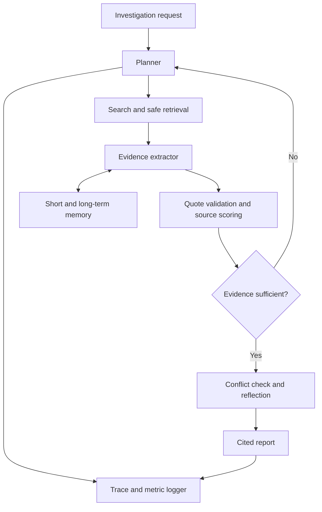

# TraceLens

TraceLens is an evaluation-first OSINT investigation agent. It does not only produce an answer: it preserves evidence provenance, identifies contradictions, exposes confidence progression, compares memory modes, and measures whether additional investigation genuinely improves reliability.

## What it demonstrates

- Investigation of companies, people, and factual claims
- Adaptive multi-source research
- Verbatim evidence extraction with programmatic quote verification
- Transparent source-reliability heuristics
- `supported`, `refuted`, `mixed`, and `insufficient_evidence` verdicts
- None, short-term, and persistent long-term memory modes
- Step traces, confidence progression, token usage, latency, and optional cost
- A six-case benchmark harness

## Architecture



Claude proposes semantic interpretations and investigation actions. Deterministic application logic owns provenance, quote validation, source scores, confidence, budgets, stopping, persistence, and metrics.

## Quick start

```bash
python -m venv .venv
source .venv/bin/activate
pip install -r requirements.txt
cp .env.example .env
```

Configure the third-party OpenAI-compatible endpoint in `.env`:

```env
LLM_API_KEY=your_key
LLM_BASE_URL=https://your-provider.example/v1
LLM_MODEL=your_exact_model_identifier
LLM_TEMPERATURE=
```

The base URL should include the provider's API prefix, commonly `/v1`. Temperature is omitted by default for compatibility with routes that enforce a fixed value. Set `LLM_TEMPERATURE=1` only if your provider requires it explicitly. Then run:

```bash
uvicorn app.main:app --reload
```

Open `http://127.0.0.1:8000/docs` for the functional Swagger interface.

Example:

```bash
curl -X POST http://127.0.0.1:8000/investigations \
  -H 'Content-Type: application/json' \
  -d '{
    "subject":"Microsoft acquisition of GitHub",
    "question":"Did Microsoft acquire GitHub in 2018 for 7.5 billion US dollars?",
    "subject_type":"company",
    "memory_mode":"short",
    "max_steps":8,
    "max_tool_calls":12
  }'
```

## API

| Method | Endpoint | Purpose |
|---|---|---|
| GET | `/health` | Readiness check |
| POST | `/investigations` | Run an investigation |
| GET | `/investigations/{id}` | Complete stored result |
| GET | `/investigations/{id}/report` | Findings without internal trace |
| GET | `/investigations/{id}/trace` | Process and model-usage trace |
| POST | `/benchmarks/run` | Run all cases across memory modes |

## Memory modes

- **none**: no information is retrieved from prior investigations.
- **short**: the typed investigation state retains claims, queries, evidence, conflicts, and confidence within the episode.
- **long**: short-term state plus persistent provenance-backed leads from earlier episodes. A retrieved memory is never treated as evidence until its URL is fetched and revalidated.

Long-term retrieval currently uses transparent lexical overlap. This is intentionally small and inspectable for the benchmark scale; embeddings are a future upgrade.

## Evidence integrity

The LLM must return an excerpt and an exact supplied URL. TraceLens normalizes whitespace and verifies that the excerpt exists in the retrieved document. Invalid excerpts, unknown claim IDs, and unknown URLs are discarded. Final citations are derived from accepted evidence rather than generated by the model.

OpenAI-compatible proxy routes sometimes return nearly valid JSON even when prompted for a strict schema. TraceLens repairs common syntax defects, then still applies full Pydantic validation. Repair does not bypass schema or evidence checks.

## Confidence and stopping

Confidence combines claim coverage, the weighted support/refute margin, and independent source groups. It is reduced for sparse or conflicting evidence. The system abstains instead of forcing a conclusion when coverage or evidence strength is low.

The bounded loop stops after convergence criteria or configured step/tool budgets. Search and fetch failures are logged and do not silently become evidence.
Gap-analysis calls are skipped when no retrieval budget remains, avoiding model calls that can propose searches the system cannot execute.

## Metrics

- Evidence coverage: covered atomic claims / all atomic claims
- Citation validity: whether every reported URL belongs to verified evidence
- Source diversity: independent source groups / 3, capped at 1.0
- Efficiency: model calls, tool calls, tokens, latency, and optional estimated cost
- Benchmark verdict accuracy: correct completed episodes / completed labeled episodes

API prices are not hardcoded. Set `INPUT_COST_PER_MTOK` and `OUTPUT_COST_PER_MTOK` to calculate estimated cost for the configured model.

## Benchmarks

`benchmarks/cases.json` contains six stable cases covering supported, refuted, date-confusion, insufficient-evidence, and memory-interference behavior.

Run through the API:

```bash
curl -X POST http://127.0.0.1:8000/benchmarks/run
```

This consumes API calls. Raw results are written to `outputs/benchmarks/latest.json`. Results must never be claimed before running them.

## Tests

Tests mock no live investigation and therefore spend no API credits:

```bash
pytest -q
```

They cover quote validation, conflict handling, abstention, source independence, persistence, memory filtering, URL safety, bounded scores, and API health.

## Design choices

- **Direct typed loop instead of a framework-heavy graph:** easier to audit under the assignment deadline.
- **SQLite instead of a vector service:** reproducible and sufficient for a small evaluation harness.
- **Own retrieval tools instead of opaque model browsing:** makes provenance, costs, and source selection observable.
- **Deterministic confidence instead of self-reported LLM confidence:** reduces unsupported certainty.
- **Synchronous investigation endpoint:** intentionally simple for the take-home; a production system would use a durable job queue.

## Limitations

- Search availability and rankings can change.
- Source reliability is heuristic and domain-level.
- HTML extraction is not a full browser and may miss JavaScript-rendered pages.
- The benchmark is too small to establish general calibration.
- Lexical long-term retrieval is less robust than entity-aware embedding retrieval.
- A verified quotation proves provenance, not that the source itself is truthful.
- The current benchmark runner performs live investigations and can take time and API credits.

## Future work

- Cached replay fixtures for deterministic offline benchmarks
- Entity-linked embedding memory and freshness policies
- Durable asynchronous workers
- Claim-level Brier calibration on a larger benchmark
- Syndication and source-dependency detection
- Browser-based retrieval for dynamic pages
- Human review queues for high-impact or unresolved investigations
